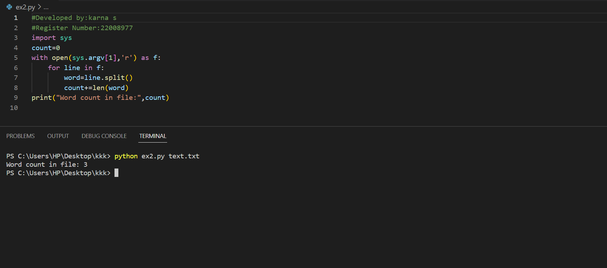

# command-line-arguments-to-count-word
## AIM:
To write a python program for getting the word count from the contents of a file using command line arguments.
## EQUIPEMENT'S REQUIRED: 
PC
Anaconda - Python 3.7
## ALGORITHM: 
### Step 1:Get the file name using command arguments

### Step 2: Now read the content in the file
 
### Step 3: use split()

### Step 4:Now read the No.of words in file

### Step 5:Print the number of words present in given file

### Step 6:End the program 

## PROGRAM:
```
Developed by:karna s
Register Number:22008977
```


### OUTPUT:



## RESULT:
Thus the program is written to find the word count from the contents of a file using command line arguments.
